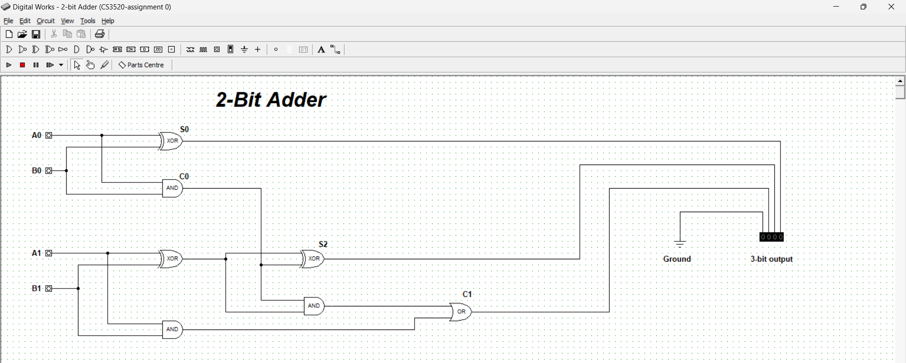

# Report

## Group members
1. Kabelo Thesele
2. Napo Qheku
3. khiba Ratele
4. Ts'epo Mokhabi
5. Motseki Maetlane
6. Repholositsoe Nchochoba

# Design and Simulation of a 2-Bit Binary Adder

## Abstract
This report details the design, simulation, and testing of a 2-bit binary adder circuit. The project involved creating a digital logic circuit using basic gates, testing the circuit across all input scenarios, and validating its functionality.

## OBJECTIVE
The objective of this project was to design, simulate, and test a 2-bit binary adder circuit. A 2-bit binary adder is a digital circuit used to add two binary numbers. The goal was to ensure the circuit correctly computes the sum and the carry for all possible input combinations.

## Circuit Design
The circuit was designed using two half adders and an OR gate. The first half adder processes the least significant bits, while the second half adder manages the most significant bits along with the carry-in. The OR gate handles the final carry-out bit.

## Simulation Process
The circuit was simulated using Logisim. Each input scenario was tested to ensure the circuit correctly computed the sum and carry-out values.

- [Simulation Video](https://youtu.be/o_3akUZPG7s)

## Testing Strategy and Results
Each possible combination of 2-bit inputs was tested. The table below summarizes the test cases and results.

| Test Case | A1 | A0 | B1 | B0 | Expected Sum | Expected Carry-out | Actual Sum | Actual Carry-out |
|-----------|----|----|----|----|--------------|-------------------|------------|-----------------|
| 1         | 0  | 0  | 0  | 0  | 00           | 0                 | 00         | 0               |
| 2         | 0  | 0  | 0  | 1  | 01           | 0                 | 01         | 0               |
| 3         | 0  | 0  | 1  | 0  | 10           | 0                 | 10         | 0               |
| 4         | 0  | 0  | 1  | 1  | 11           | 0                 | 11         | 0               |
| 5         | 0  | 1  | 0  | 0  | 01           | 0                 | 01         | 0               |
| 6         | 0  | 1  | 0  | 1  | 10           | 0                 | 10         | 0               |
| 7         | 0  | 1  | 1  | 0  | 11           | 0                 | 11         | 0               |
| 8         | 0  | 1  | 1  | 1  | 00           | 1                 | 00         | 1               |
| 9         | 1  | 0  | 0  | 0  | 10           | 0                 | 10         | 0               |
| 10        | 1  | 0  | 0  | 1  | 11           | 0                 | 11         | 0               |
| 11        | 1  | 0  | 1  | 0  | 00           | 1                 | 00         | 1               |
| 12        | 1  | 0  | 1  | 1  | 01           | 1                 | 01         | 1               |
| 13        | 1  | 1  | 0  | 0  | 11           | 0                 | 11         | 0               |
| 14        | 1  | 1  | 0  | 1  | 00           | 1                 | 00         | 1               |
| 15        | 1  | 1  | 1  | 0  | 01           | 1                 | 01         | 1               |
| 16        | 1  | 1  | 1  | 1  | 10           | 1                 | 10         | 1               |

further test cases screenshots are in the Circuit Test Cases Folder

## Challenges and Solutions
We had to quickly get up to speed with GitHub and YouTube for this project. Learning GitHub involved understanding version control, collaboration through branches, and writing clear documentation using Markdown. We also explored how to publish our report using GitHub Pages.

For YouTube, we had to learn video production skills, including capturing simulation footage, editing, and scriptwriting, to clearly demonstrate our circuit's functionality. This experience challenged us to effectively use modern tools for collaboration and presentation, essential skills for our future.

##	CONCLUSION

The design and testing of the 2 – bit binary adder were successfully completed. The circuit performed correctly for all input combinations, and the simulation results matched the expected outcomes. The challenges encountered during the simulation, such as timing issues and carry propagation were effectively resolved. The project demonstrates a thorough understanding of digital circuit design and simulation.
