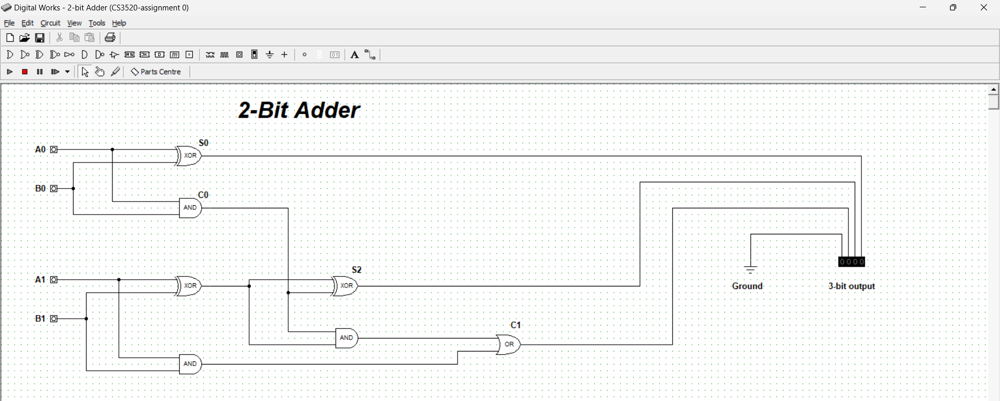

# Report

## Group members
1. Kabelo Thesele
2. Napo Qheku
3. khiba Ratele
4. Ts'epo Mokhabi
5. Motseki Maetlane
6. Repholositsoe Nchochoba

# Design and Simulation of a 2-Bit Binary Adder

## Abstract
This report details the design, simulation, and testing of a 2-bit binary adder circuit. The project involved creating a digital logic circuit using basic gates, testing the circuit across all input scenarios, and validating its functionality.

## OBJECTIVE
The objective of this project was to design, simulate, and test a 2-bit binary adder circuit. A 2-bit binary adder is a digital circuit used to add two binary numbers. The goal was to ensure the circuit correctly computes the sum and the carry for all possible input combinations.

## Circuit Design
The circuit was designed using two half adders and an OR gate. The first half adder processes the least significant bits, while the second half adder manages the most significant bits along with the carry-in. The OR gate handles the final carry-out bit.

